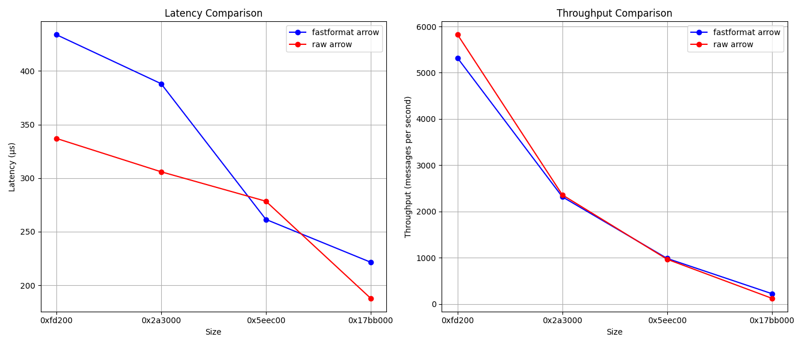

# 🚀 **fastformat: High-Performance Data Processing Library**

---

## **Benchmarking**

it's interesting to see how fastformat performs against using classic raw arrow arrays.

---

## 🙌 **Contributing**

We welcome contributions! Feel free to submit issues or pull requests. Check the [CONTRIBUTING](./CONTRIBUTING.md) guide for more information.

---

## 📜 **License**

This project is licensed under the **MIT License**. See the [LICENSE](./LICENSE) file for details.

---

🚀 Happy coding with **fastformat**!
